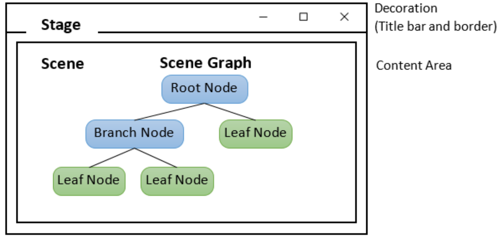
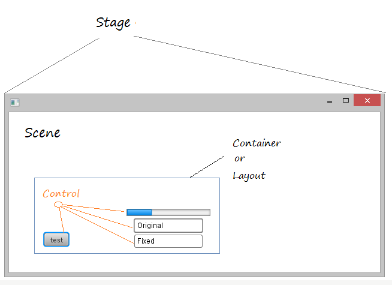
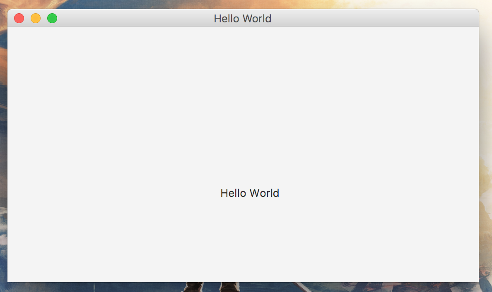
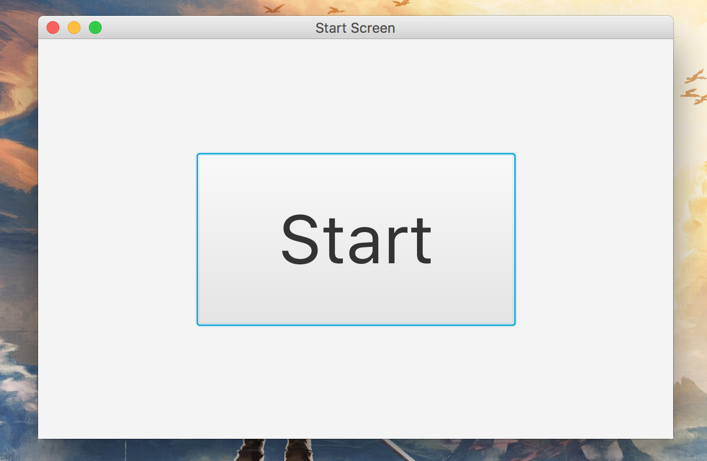
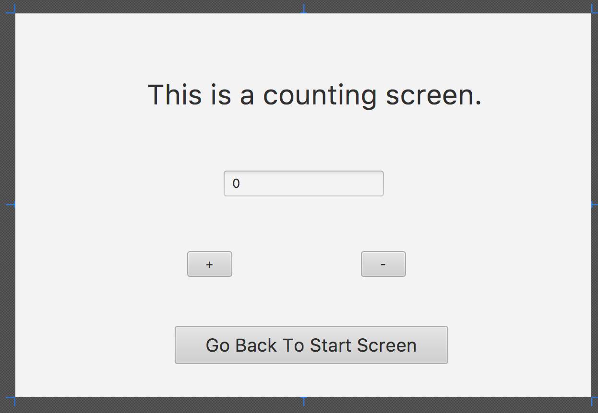
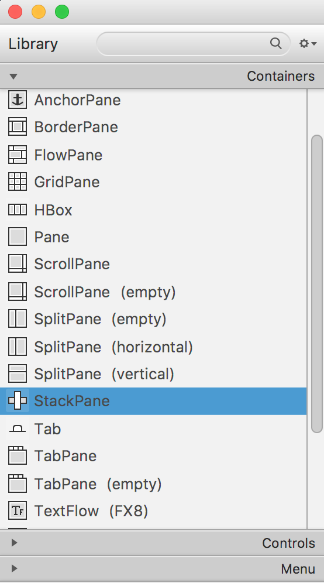
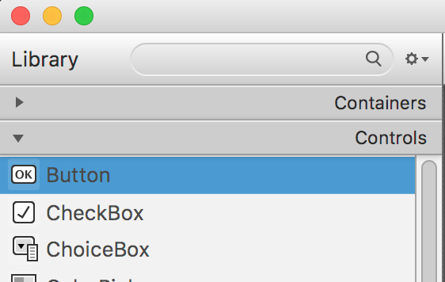
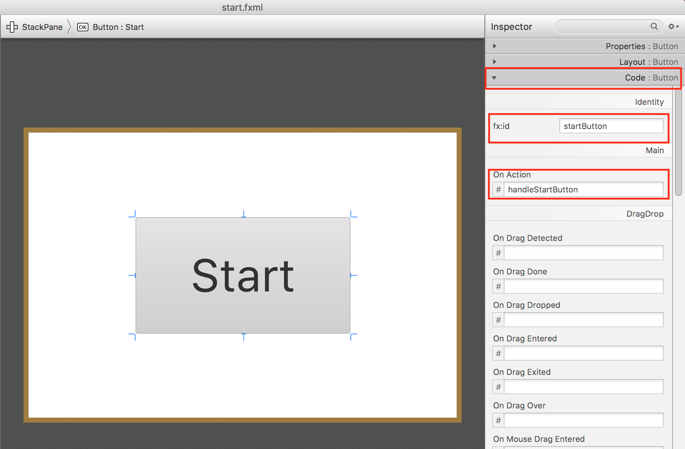

## JavaFX videos

Please watch the following four videos before you start the exercise: 

[JavaFx_example_Thu_Wk07_Lect](https://d2xnkjysn6lg7q.cloudfront.net/files/unswVideo/sourceVideo/1594362116963-javafx_example_thu_wk07_lect.mp4) (16 mins, the week-06 lecture from 20T2)

[JavaFx_selfstudy_example_video](https://d2xnkjysn6lg7q.cloudfront.net/files/unswVideo/sourceVideo/1594361803294-javafx_selfstudy_example_video.mp4) (17 mins, from 19T3)

[JavaFx_Grade_example_video](https://d2xnkjysn6lg7q.cloudfront.net/files/unswVideo/sourceVideo/1594362656933-javafx_grade_example_video.mp4) (21 mins, **must** watch 10:00 mins onwards, from 19T3) 

[JavaFx_animation_example_video](https://d2xnkjysn6lg7q.cloudfront.net/files/unswVideo/sourceVideo/1594362993025-javafx_animation_example_video.mp4)  (13 mins, from 19T3)

Please make sure to watch "JavaFx_Grade_example_video (10:00 mins onwards)" which discusses **Wrapper** classes, **BooleanProperty** class along with it's **bidirectional** property - example of the Observer pattern. 


# Overview

This is a simple self-learning exercise for familiarising yourself with JavaFX. It does contain a complete solution, but it is recommended to follow the steps yourself and only refer to the solution when you get stuck.

This exercise assumes that you've done the **Project setup** steps from the project spec if not using a CSE machine - to port from the CSE machine version on Gitlab to your own Operating System.

https://gitlab.cse.unsw.edu.au/COMP2511/final_project

This includes that you may need your ".vscode/launch.json", "lib" and "bin" files/folders to be setup as on this repository or as appropriate for your Operating System before following the instructions in this exercise.

Once you've followed those steps, you can import this project into VSCode and run the solution. Similarly to the project starter code, to run the solution you should open the root directory of the cloned repository in VSCode, open the appropriate java file (containing a subclass of javafx.application.Application), and click the "Run" link above the "main" method.

Note that this version of this repository should work immediately if you clone onto a CSE machine, but not on other computers since it relies on a symbolic link to the COMP2511 copy of JavaFX in the "lib" directory.

# Part 0: JavaFX Starter

## Understanding the JavaFX Architecture

JavaFX uses the metaphor of a theatre to model graphical user interfaces. A **stage** (defined by the `javafx.stage.Stage` class) represents the top-level container (window). The individual **controls** (buttons, textboxes, labels, etc) are contained in a **scene** (defined by the `javafx.scene.Scene` class). An application can have more than one scene, but only one of the scenes can be displayed on the stage at any given time.

The contents of a scene is represented by a hierarchical scene graph of **nodes** that represents all of the visual elements of the application’s user interface. A single element in a scene graph is called a **node** (defined by `javafx.scene.Node`). With the exception of the root node of a scene graph, each node has a single parent and zero or more children.  Hence, each node is either a "leaf", with no children, or a "branch" with multiple children. Leaf nodes are typically basic geometric shapes, like rectangles, or text nodes. Branch nodes (defined by `javafx.scene.Parent`) allow nodes to be composed to form more complex UI elements.



The scene graph in JavaFX is an instance of the Composite pattern. The `Node` class is the component, `Parent` the composite and `Rectangle`, `Circle`, `Line`, etc. are different leaves.

**Panes** (also known as **Layout Containers**) are a specific type of branch in the graph. Panes can be used to allow for flexible and dynamic arrangements of the UI controls within a scene graph of a JavaFX application. There are many JavaFX predefined panes. Some of these are briefly described below.  You can read more about panes [here](https://docs.oracle.com/javafx/2/layout/builtin_layouts.htm).

* The BorderPane lays out its content nodes in the top, bottom, right, left, or center region.
* The HBox arranges its content nodes horizontally in a single row.
* The VBox class arranges its content nodes vertically in a single column.
* The StackPane class places its content nodes in a back-to-front single stack.
* The GridPane class enables the nodes to be created in a flexible grid of rows and columns in which to lay out content nodes.

The picture below shows the relationship between **Stage**, **Scene**, **Container** and **Controls**.



This is a brief overview of the JavaFX architecture.  The JavaFX API is extensive with several packages and classes.  For your project, you may have to do some of your own research into JavaFX to achieve your design.

## Creating a Graphical User Interface (GUI) using JavaFX based on MVC

A typical JavaFX application consists of a graphical user interface built using the components described above, that interacts with the back-end application logic. The JavaFX platform provides **FXML**, a scriptable, XML based markup language for constructing scene graphs. FXML can be a more convenient alternative to constructing such graphs in procedural code and is ideally suited to defining the user interface of a JavaFX application, since the hierarchical structure of an XML document closely parallels the structure of the JavaFX scene graph. The benefits of using FXML is that the application interface design is separated from the application logic, thereby making the code easier to maintain.

Use of FXML enables us to structure a JavaFX application based on the **MVC** (Model-View-Controller) architecture which typically comprises of three key components as described below:
_(MVC will be covered more generally in lectures)_

* A **view** consisting of a FXML file which defines the user-interface components represented by the hierarchical scene graph of nodes
* A **Controller** (written as a Java class) that receives the events initiated by clicking on the different UI controls (e.g., button) on the GUI and directs these events to the Model
* A **Model** (also a java class) which contains the state of the application, and methods to change that state.

The MVC architecture provides for a software architecture where the model, view and controller components are decoupled, making the application easier to understand and maintain.  More details about FXML and the benefits of its use can be found in this [link](https://docs.oracle.com/javafx/2/fxml_get_started/why_use_fxml.htm#CHDCHIBE).

JavaFX provides all the major UI controls that are required to develop a full-featured application. However, the look and feel of your UI can be customised using Cascading Style Sheets (CSS) which separate appearance and style from implementation.  Customised styling can be applied to UI of a JavaFX application without changing any of that application's source code. JavaFX CSS styles can also be easily assigned to the scene at runtime, allowing an application's appearance to dynamically change.

## JavaFX SceneBuilder

JavaFX Scene Builder, a design tool for the JavaFX platform, allows simple drag-and-drop positioning of the graphical user interface (GUI) components onto a JavaFX scene. JavaFX SceneBuilder is a WYSIWYG (What You See Is What You Get) editor for FXML files and as you build your GUI components, the Scene Builder generates FXML markup code.

## Getting SceneBuilder

You can run SceneBuilder on CSE lab machines with "2511 scenebuilder". For other computers, you'll need to download SceneBuilder from [here](https://gluonhq.com/products/scene-builder/). To ensure compatibility with your Java 11 project, use the Java 11 version of SceneBuilder.

You may wish to install the VSCode extension "Scenebuilder Extension for Visual Studio Code". This will enable you to run Scenebuilder for a particular file from VSCode, by right clicking the file and selecting "Open in Scenebuilder". If you wish to do this, after installing the extension, you will need to configure the Scenebuilder path in VSCode by pressing CTRL-SHIFT-P (to open the command palette), selecting "Configure Scene Builder path", and navigating to and selecting the Scenebuilder application on your machine (will vary by Operating System). On the CSE machine you would need to navigate to and select "/import/ravel/3/cs2511/bin/scenebuilder". Note that to navigate to the root directory "/" on a CSE machine, you need to select "+ Other Locations" at the bottom of the scrolling list on the left side of the file manager.

# Part 1: Create a Hello World Application

## Step 0: Create a new JavaFX project

This first tutorial is a simple example aimed at introducing JavaFX and FXML.  This example does not make use of any interactive UI controls, e.g. Buttons, hence no controller classes are needed.

* Create a new folder in VSCode called 'javafx-exercise'.
* Create a file `HelloApplication.java` in a folder `src/example/javafxtest` under the root directory of 'javafx-exercise' and copy and paste this code into it:

```java
package example.javafxtest;

import javafx.application.Application;
import javafx.scene.Scene;
import javafx.scene.layout.BorderPane;
import javafx.stage.Stage;


public class HelloApplication extends Application {
    @Override
    public void start(Stage primaryStage) {
        BorderPane root = new BorderPane();
        Scene scene = new Scene(root, 600, 400);

        primaryStage.setScene(scene);
        primaryStage.show();
    }

    public static void main(String[] args) {
        launch(args);
    }
}
```

You should be able to run this program, but you'll see it all it does is show an empty window.

------------

## Step 1: Create an FXML file for the static screen

* We are going to create a new FXML file for the screen showing the text "Hello World!".
  * In the `src/example/javafxtest` folder under the root directory of 'javafx-exercise', create a new file called `sample.fxml`. Now we need to add content to the FXML file. We will use JavaFX SceneBuilder to construct our FXML markup file.
  * Open your **JavaFX SceneBuilder** and choose **File -> Open** to open the file `sample.fxml`.
  * On the left-hand side of  panel, select the first top level drop-down item **Containers** and inside **Containers** choose **Panel** and drag it into the central preview
  * Similarly, select the second top level drop-down item **Controls** and inside **Controls** choose **Label** and drag it to the central preview
  * For the **Label**, Modify the text by double clicking the text on the **Label** and change to "Hello World"
  * Finally, save your work and switch back to **VSCode**.
* If you view the file in VSCode (you may need to right click and *refresh*) you can see the basic structure of the FXML file.

------------

## Step 2: write the JavaFX code to launch the Hello World Application

* Firstly, look at the auto-generated code in `Main.java` (alternatively, it may not be created yet - in such a case create the file and paste the below code into the file `HelloApplication.java`).  Edit the file `Main.java` to delete the contents of the method `start()` and rewrite the implementation of `start()` as shown in the code below, and rename the file to `HelloApplication.java`.

```java
package example.javafxtest;

import java.io.IOException;

import javafx.application.Application;
import javafx.fxml.FXMLLoader;
import javafx.scene.Parent;
import javafx.scene.Scene;
import javafx.stage.Stage;

public class HelloApplication extends Application {
    @Override
    public void start(Stage primaryStage) throws IOException {
        primaryStage.setTitle("Hello World");

        Parent root = FXMLLoader.load(getClass().getResource("sample.fxml"));
        primaryStage.setScene(new Scene(root, 600, 400));
        primaryStage.show();
    }

    public static void main(String[] args) {
        launch(args);
    }
}
```

------------

Here are some important things to know about the basic structure of a JavaFX application:
(_You need to refer to the code snippet above in order to understand the following explanation._)

* The main class for a JavaFX application extends the `javafx.application.Application` class. The `start()` method is the main entry point for all JavaFX applications. In practice, to configure the first stage of every application, you _should always_ override the method `start()`.
* A JavaFX application defines the user interface container by means of a stage and a scene. (You may need to review part 0 to understand the terminology) The JavaFX `Stage` class is the top-level JavaFX container. The JavaFX `Scene` class is the container for all content.
* Inside the method body of `start()` method:
  * We first set the title of our stage (referred to as the primaryStage in the code above)
  * Next, we build the scene to be associated with this stage.  For this, we load the FXML content into a node called `root` of type `Parent`.
  * Next, we associated the scene (loaded from FXML) to the `primaryStage`.
  * Finally, in order to display the stage, we called the method `show()`.
* In the main method, `launch(args)` will launch the app.
* You can refer to [JavaFX documentation](https://openjfx.io/javadoc/11/) to see more details on each of the methods described above.

Running the app should now create a window like the following:



------------

## After completing this section

* You should know the basic structure of a JavaFX application.
* You should be familiar with some JavaFX predefined panes.
* You should be able to use JavaFX SceneBuilder.
* You should be familiar with basic JavaFX methods.

# Part 2: How to handle a JavaFX event

You have learnt how to create a JavaFX application with only one static screen. But what if you want the application to have multiple screens or have buttons to make it dynamic?  In this tutorial, we create a small application that lets us increment and decrement a counter.

* The concept of a **Controller** class will also be introduced in this tutorial. It will provide event handling functionalities and can interact with the backend **Model**.
* When dealing with multiple screens, for every screen, we create one **Screen** class and an associated **Controller** class for that screen.

## Overview

Here you will creating an application with two screens. The first screen will look like this:

  

After clicking the `Start` button on this screen, the app will switch to the counting screen.

  .

Initially, we will create the two screens and implement the correct behaviour for the "Start" and "Go Back..." buttons. The necessary steps below are outlined below:

* [Step 0: Create new files](#step-0-create-new-files)
* [Step 1: Edit start.fxml and count.fxml](#step-1-edit-startfxml-and-countfxml)
* [Step 2: Add methods in StartScreen.java,  CountScreen.java and CountingApplication.java](#step-2-add-methods-in-startscreenjava-countscreenjava-and-countingapplicationjava)
* [Step 3: Add methods in StartController.java and CountController.java](#step-3-add-methods-in-startcontrollerjava-and-countcontrollerjava)

---

### <a id="part1-step0"></a>Step 0: Create new files

* Recall that it is a good practice to create a controller for each screen. Now we have two screens, which I call **StartScreen** and **CountScreen**. Therefore, we should have two corresponding controllers for them, which I call **StartController** and **CountController**. So, from within VSCode, we create four Java files, namely, **StartScreen.java**, **CountScreen.java**, **StartController.java**, and **CountController.java**. Put these classes in the `src/example/counter` folder. We will add methods to these classes shortly.
* Additionally, recall that to draw the UI components on the screen, we need to create FXML files. Following the procedure in the last tutorial, two more FXML files must be created, namely `count.fxml` and `start.fxml`.
* Finally, we need to have a **CountingApplication** class to launch the application.

---

### <a id="part1-step1"></a>Step 1: Edit start.fxml and count.fxml

* Open your JavaFX SceneBuilder and load `start.fxml` by selecting **File -> Open -> start.fxml** on the top bar. Then on the left-hand side of panel, select the first top level drop-down item **Containers** and inside **Containers** choose **StackPane** and drag it into the central preview. Then select the second top level drop-down item **Controls** and inside **Controls** choose **Button** and drag it into the central preview.

  

* For the **Button**, Modify the text by double clicking the text on the **Button** and change to "Start"

  

* Selecting the **Button** component, we now need to modify the properties of this component through the Property Inspector Panel on the right hand side of the Scene Builder. Under the Inspector Panel, you will notice three drop-down menus: *Properties*, *Layout*, *Code*. Expand the drop-down *Code* and configure the following:
  * Assign a `fx:id` to the "Start" button
  * The next step is to handle the event of clicking "Start" button. Assign an `On Action` handler to the "Start" button. Call it `handleStartButton` as in the picture below.

    

  * **Exercise:** Try to edit `count.fxml` to add the button and the label by yourself. The other controls will be added below. You should have a 500x300 `Pane` as the root element. Set the `fx:id` and `On Action` handler for the button `Go Back To Start Screen`.

------------

### <a id="part1-step2"></a>Step 2: Add methods in StartScreen.java,  CountScreen.java and CountingApplication.java

To start with `StartScreen` should look like this:

```java
package example.counter;

import java.io.IOException;

import javafx.fxml.FXMLLoader;
import javafx.scene.Parent;
import javafx.scene.Scene;
import javafx.stage.Stage;

public class StartScreen {

    private Stage stage;
    private String title;
    private StartController controller;
    private Scene scene;

    public StartScreen(Stage stage) throws IOException {
        this.stage = stage;
        title = "Start Screen";

        controller = new StartController();
        FXMLLoader loader = new FXMLLoader(getClass().getResource("start.fxml"));
        loader.setController(controller);

        // load into a Parent node called root
        Parent root = loader.load();
        scene = new Scene(root, 500, 300);
    }

    public void start() {
        stage.setTitle(title);
        stage.setScene(scene);
        stage.show();
    }

    public StartController getController() {
        return controller;
    }
}
```

Notice how the controller is set with the `setController(..)` method of `FXMLLoader`. That connects the controller to the view.

`CountScreen.java` is left as an exercise as it is very similar.

For now, `CountingApplication` just needs to create the two screens and start the start screen.

```java
package example.counter;

import java.io.IOException;

import javafx.application.Application;
import javafx.stage.Stage;

public class CountingApplication extends Application {

    @Override
    public void start(Stage primaryStage) throws IOException {
        StartScreen startScreen = new StartScreen(primaryStage);
        CountScreen countScreen = new CountScreen(primaryStage);

        startScreen.start();
    }

    public static void main(String[] args) {
        launch(args);
    }
}
```
------------

### <a id="part1-step3"></a>Step 3: Add methods in StartController.java and CountController.java

Initially, the `StartController` class will look like this:

```java
package example.counter;

import javafx.event.ActionEvent;
import javafx.fxml.FXML;
import javafx.scene.control.Button;

public class StartController {

    @FXML
    private Button startButton;

    @FXML
    public void handleStartButton(ActionEvent event) {

    }
}
```

Notice the `@FXML` annotation. This annotation connects fields and methods in your controller to nodes and values in the FXML file. Any elements in the FXML file with an `fx:id` need a corresponding field in the controller class with an `@FXML` annotation. Similarly, any *On Action* or similar handlers need a corresponding method in the controller, also with an `@FXML` annotation.

An implementation needs to be provided for `handleStartButton(...)` that switches to the count screen. However, the `CountScreen` created in the `CountingApplication` is not accessible from this class. This can by the following.

* Add a field to hold the `CountScreen` and a setter for updating it.
* Call the `start()` method of the count screen in `handleStartButton(...)`.
* Modify `CountingApplication` so that it calls `setCountScreen(...)`.

The controller should now look like this:

```java
package example.counter;

import javafx.event.ActionEvent;
import javafx.fxml.FXML;
import javafx.scene.control.Button;

public class StartController {

    @FXML
    private Button startButton;

    private CountScreen countScreen;

    @FXML
    public void handleStartButton(ActionEvent event) {
        countScreen.start();
    }

    public void setCountScreen(CountScreen countScreen) {
        this.countScreen = countScreen;
    }

}
```

Follow the same process to implement `CountController`.

------------

# Part 3: Dynamically updating the controls

Here we will:

* Add buttons for *+* and *-*, and a number field in `count.fxml`.
* Add handler methods in **CountController** class.

The steps are:

- [Step 0: Edit count.fxml](#step-0-edit-countfxml)
- [Step 1: Add methods in CountController.java](#step-1-add-methods-in-countcontrollerjava)

------------

### <a id="part2-step0"></a>Step 0: Edit count.fxml

Add the buttons in SceneBuilder and give them the following properties. You should how to do this now.

| button  | `fx:id`     | *On Action* |
| --------|:-----------:| -----------:|
| *+*     | plusButton  | handlePlus  |
| *-*     | minusButton | handleMinus |

Add a `TextField` with an `fx:id` of `numberField`.

---------

### <a id="part2-step1"></a>Step 1: Add methods in CountController.java

Add `@FXML` fields and methods to `CountController` to make it consistent with the newly created FXML file.

After that, you will need to add a new method called `initialize()`. This is also a FXML-related method (so needs the annotation), and its name is fixed. It is for predefining our components on the scene and is called after the FXML file is loaded. In this example, we just use this method to set the number field to 0. This could be done in other ways, but we do it here to demonstrate the use of an `initialize()` method. See if you can implement this method by calling the relevant method of `TextField`.

Any changes you make controls in these event handlers will be reflected in the UI after the method returns.

The complete working controller is below. You may wish to consider whether its design could be improved. At the moment, if the user types something other than a number an exception is raised.

```java
package example.counter;

import javafx.event.ActionEvent;
import javafx.fxml.FXML;
import javafx.scene.control.Button;
import javafx.scene.control.TextField;

public class CountController {

    @FXML
    private Button backButton;

    @FXML
    private Button minusButton;

    @FXML
    private Button plusButton;

    @FXML
    private TextField numberField;

    private StartScreen startScreen;

    @FXML
    public void handleBackButton(ActionEvent event) {
        startScreen.start();
    }

    public void setStartScreen(StartScreen startScreen) {
        this.startScreen = startScreen;
    }

    @FXML
    public void initialize() {
        numberField.setText("0");
    }

    @FXML
    public void handleMinus(ActionEvent event) {
        int value = Integer.parseInt(numberField.getText());
        numberField.setText(Integer.toString(value - 1));
    }

    @FXML
    public void handlePlus(ActionEvent event) {
        int value = Integer.parseInt(numberField.getText());
        numberField.setText(Integer.toString(value + 1));
    }

}
```
